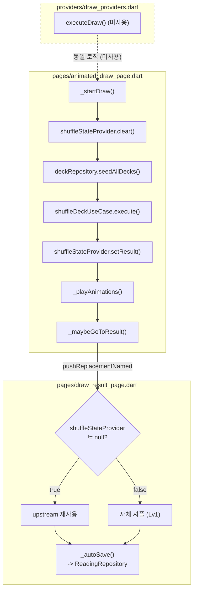
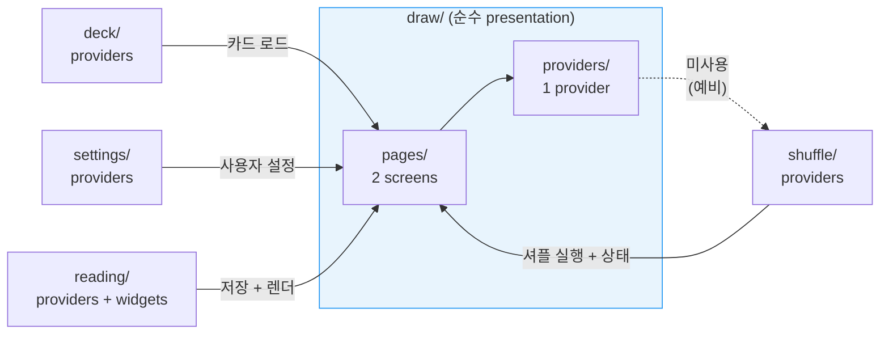

# Critic 보고서 — Round 1

## Scores
| 축 | 점수 | 근거 |
|----|------|------|
| Function | 2 | 핵심 요구사항(폴더 구조, 역할, 데이터 흐름, 의존성, 주의사항)을 모두 다루지만, scope intent인 "시각화 중심 고도화"에는 미달. ASCII art 1개 의존, mermaid 0개. |
| Edge | 2 | 예외 상황(domain/data 부재, 셔플 로직 중복, provider 미사용)을 적절히 기술. 빈 값/경계값에 대한 별도 논의는 해설 문서 특성상 필요 없음. |
| UX | 1 | **얼개->세부 순서 위반**: 개요 직후 바로 구조 트리와 표로 들어감. 전체 흐름의 30초 파악이 불가. ASCII art 다이어그램이 복잡하여 시각적 스캔이 어려움. mermaid 전환 기회를 모두 놓침. |
| Robustness | 2 | 주장에 근거 없는 비약 없음. 코드 분석 기반의 사실적 기술. providers/pages 관계 설명이 정확. 다만 "향후 통합" 전망은 근거가 약함. |
| Completeness | 2 | scope 범위(폴더 해설)를 빠짐없이 다루나, Lv3/Lv4 진입 경로에 대한 흐름이 이 문서에서는 언급만 되고 시각화되지 않음. |

## Findings

### UX-01 — ASCII art 다이어그램을 mermaid flowchart로 전환 필요
- **severity**: major
- **status**: fail
- **evidence**: _overview.md 48~67행, "동작 흐름 (Flow)" 섹션 전체
- **detail**: 22줄짜리 ASCII art가 데이터 흐름의 핵심 시각화인데, (1) 모노스페이스 폰트 의존으로 GitHub 모바일에서 깨짐, (2) 관계선이 `──`, `│`, `▼` 조합이라 시각 파싱에 인지 부하가 높음, (3) mermaid라면 자동 레이아웃+클릭 가능 노드로 대체 가능.
- **🏷 gate_verdict**: 동의
- **🏷 gate_reason**: "핵심 개선점. mermaid 초안을 기반으로 하되, COMP-01의 Lv3/4 경로도 통합하여 하나의 완성된 다이어그램으로 만들 것."
- **fix_suggestion**:


### UX-02 — 빅픽처 다이어그램 부재: 첫 5줄 내 폴더 존재 이유 파악 불가
- **severity**: major
- **status**: fail
- **evidence**: _overview.md 14~20행 ("개요" 섹션)
- **detail**: 개요가 텍스트 3줄로만 구성. "순수 presentation 피처"라는 핵심 개념이 "역할" 섹션(24~28행)에 가서야 나옴. 읽는 사람이 처음 5줄에서 이 폴더의 위치와 존재 이유를 한눈에 파악하려면 다른 피처와의 관계를 보여주는 조감도(bird's eye)가 필요.
- **🏷 gate_verdict**: 동의
- **🏷 gate_reason**: "'얼개로 시작' 원칙의 핵심. 개요와 역할 사이에 배치. mermaid 초안의 providers→pages 화살표 방향이 역전되어 있으므로 writer가 수정할 것 (pages가 providers를 참조하는 게 아니라 providers가 pages에서 사용되지 않는 것이 핵심)."
- **fix_suggestion**: 개요 직후, 구조 섹션 앞에 아래와 같은 컨텍스트 다이어그램을 삽입:


### UX-03 — 스캔 가능성: "동작 흐름" 섹션이 시각화 하나에 의존, 텍스트 해설이 분리되어 있지 않음
- **severity**: minor
- **status**: fail
- **evidence**: _overview.md 69~71행
- **detail**: ASCII art 아래의 `providers/`와 `pages/`의 관계 설명이 일반 텍스트 단락으로 작성. 다이어그램과 텍스트가 시각적으로 분리되지 않아 스캔 시 놓치기 쉬움. 핵심 정보("provider는 미사용, 페이지가 직접 구현")를 callout이나 표로 강조해야 함.
- **🏷 gate_verdict**: 동의
- **🏷 gate_reason**: "mermaid 다이어그램 아래에 '셔플 실행 방식 비교' 표를 배치하면 다이어그램의 점선(미사용)이 왜 점선인지 즉시 이해 가능."
- **fix_suggestion**: 해당 텍스트를 표 형태로 재구성:

| 구성요소 | 셔플 실행 방식 | 상태 |
|---------|-------------|------|
| `AnimatedDrawPage` | 인라인 (직접 구현) | 사용 중 |
| `DrawResultPage` | 인라인 (직접 구현) | 사용 중 |
| `executeDraw` provider | 캡슐화된 use case | 미사용 (예비) |

### COMP-01 — Lv3/Lv4 진입 경로가 시각화에서 누락
- **severity**: minor
- **status**: fail
- **evidence**: _overview.md 48~67행의 ASCII 다이어그램
- **detail**: 하위 문서 `pages/_overview.md` 62행에서 "Lv3/4: ShufflePage(shuffle 피처)가 셔플 후 동일하게 DrawResultPage로 인계"라고 명시하지만, 상위 문서 `_overview.md`의 데이터 흐름도에는 Lv3/4 진입 경로가 그려져 있지 않음. overview로서 전체 경로를 보여줘야 함.
- **🏷 gate_verdict**: 동의
- **🏷 gate_reason**: "UX-01의 mermaid 전환 시 통합 반영. 별도 작업 불필요."
- **fix_suggestion**: UX-01의 mermaid 다이어그램에 아래 노드 추가:
```mermaid
    ShufflePage["shuffle/ShufflePage\n(Lv3/Lv4)"] -->|"pushReplacementNamed"| B1
```

### FUNC-01 — 구조 트리와 하위 구성 표의 정보 중복
- **severity**: minor
- **status**: fail
- **evidence**: _overview.md 31~45행 (구조 섹션)
- **detail**: "구조" 섹션에 (1) ASCII 트리 + (2) 하위 폴더 표가 있고, 91~97행의 "하위 구성" 섹션에도 동일한 2-row 표가 반복. 같은 정보가 2곳에 3가지 형태(트리, 표1, 표2)로 존재. 이는 checkpoint 5번 항목 "반복 제거"에 위반.
- **fix_suggestion**: "구조" 섹션에서 ASCII 트리만 유지하고, 하위 폴더 표는 "하위 구성" 섹션으로 통합. 또는 "구조" 섹션에서 트리+표를 합치고 "하위 구성"에서는 해설 문서 링크만 제공.
- **🏷 gate_verdict**: 조건부
- **🏷 gate_reason**: "구조 섹션의 표를 제거하고 트리만 유지. 하위 구성 섹션의 표에 역할 컬럼을 추가하여 두 역할을 하나로 통합. 단, 구조의 트리에 한 줄 주석은 유지 (빠른 스캔용)."

## Checkpoint 특별 관점 대조

| # | 관점 | 판정 | 근거 |
|---|------|------|------|
| 1 | 정보 계층: 얼개->세부 순서 | **미달** | 개요가 텍스트 only. 빅픽처 다이어그램 없이 바로 트리 구조로 진입. "순수 presentation 피처"라는 핵심 개념이 역할 섹션까지 지연 (UX-02) |
| 2 | 시각적 밀도: 텍스트->도표 전환 기회 | **미달** | providers/pages 관계 설명(69~71행)이 텍스트 단락. 표/callout 전환 기회 남아 있음 (UX-03) |
| 3 | mermaid 적극 활용 | **미달** | mermaid 0개. 22줄 ASCII art가 유일한 다이어그램. flowchart, classDiagram 전환 가능한 곳이 최소 2곳 (UX-01, UX-02) |
| 4 | 스캔 가능성 | **부분 충족** | 헤더 구조(개요/역할/구조/흐름/의존성/주의사항)는 적절. 표도 적극 사용. 다만 흐름 섹션의 텍스트 보충이 시각적으로 약함 |
| 5 | 반복 제거 | **부분 충족** | 구조 트리 vs 하위 구성 표에서 경미한 중복 (FUNC-01). 하위 문서와의 심각한 내용 중복은 없음 |

## Anti-patterns 대조
| AP-ID | 해당 여부 | 근거 |
|-------|----------|------|
| (없음) | N/A | 프로젝트별 anti-patterns.md 미존재 |

## Summary
문서의 내용적 정확성과 완결성은 양호(Function 2, Robustness 2)하나, push의 핵심 목적인 "시각화 중심 고도화"에서 미달. mermaid 다이어그램 0개, ASCII art 1개 의존, 빅픽처 조감도 부재가 UX 점수를 1로 끌어내렸다. **major 2건(UX-01 ASCII->mermaid 전환, UX-02 빅픽처 다이어그램 추가)을 해소하면 depth_score 4.4~4.8 도달 가능.**

---

## Session Log (auto-appended)

| # | Type | Duration | Tokens |
|---|------|----------|--------|
| 1 | user-ai-exchange | 0s | 0 |
| 2 | user-ai-exchange | 0s | 0 |
| 3 | user-ai-exchange | 18s | 60949 |
| 4 | user-ai-exchange | 0s | 0 |
| 5 | user-ai-exchange | 59s | 146973 |
| 6 | user-ai-exchange | 642s | 1681853 |
| 7 | user-ai-exchange | 423s | 3654116 |
### Metrics

| Metric | Value |
|--------|-------|
| Duration | 94843s |
| Total Tokens | 5543891 |
| Input Tokens | 100 |
| Output Tokens | 55842 |
| Cache Read | 5280891 |
| Cache Creation | 207058 |
