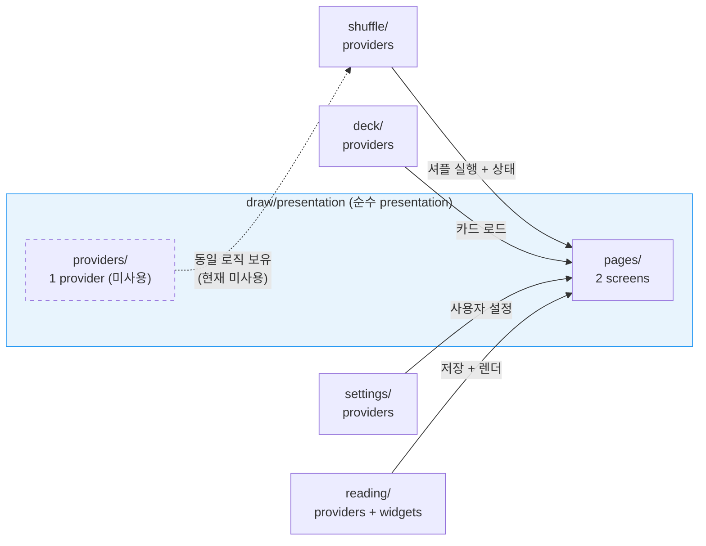
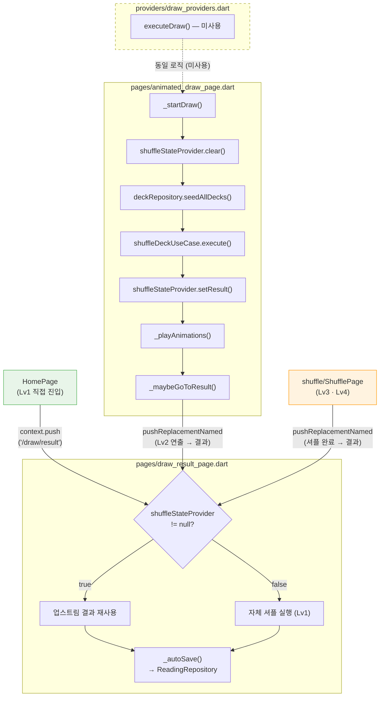

# draw/presentation/ — 해설

## 개요

뽑기 피처의 유일한 아키텍처 레이어로, 페이지(화면)와 provider(상태 관리)를 포함한다.
`draw/` 피처에는 domain/data 레이어가 없으며, 모든 비즈니스 로직은
`shuffle/`, `deck/`, `reading/`, `settings/` 피처의 provider를 직접 참조하여 조합한다.



## 역할 (Role)

이 디렉토리는 `draw/` 피처의 전체 구현을 담당한다.
`pages/`에서 2개 화면(연출 + 결과)이 뽑기 UX를 제공하고,
`providers/`에서 셔플 실행 provider가 추상화된 use case를 제공한다.

**핵심 설계**: 자체 도메인 로직 없이 다른 피처의 provider를 조합하여
뽑기 경험을 오케스트레이션하는 **순수 presentation 피처**이다.

## 구조 (Structure)

```
presentation/
├── pages/
│   ├── animated_draw_page.dart   Lv2 연출 — 질문 → 셔플 → 애니메이션 → 결과 인계
│   └── draw_result_page.dart     Lv1~Lv4 통합 결과 — 자체 셔플 or 업스트림 재사용
└── providers/
    ├── draw_providers.dart       executeDraw — one-shot 셔플 오케스트레이터
    └── draw_providers.g.dart     codegen (편집 금지)
```

## 동작 흐름 (Flow)

`presentation/` 내부의 전체 데이터 흐름:



**셔플 실행 방식 비교**:

| 구성요소 | 셔플 실행 방식 | 상태 |
|---------|-------------|------|
| `AnimatedDrawPage` | 인라인 — `_startDraw()`에서 직접 구현 | 사용 중 |
| `DrawResultPage` | 인라인 — `initState()`에서 직접 구현 (Lv1 전용) | 사용 중 |
| `executeDraw` provider | 캡슐화된 use case (동일 로직) | 미사용 (예비) |

## 의존성 (Dependencies)

**내부 피처** (조감도 참조 — 구체 provider 이름):

| 피처 | 사용하는 provider / 심볼 |
|------|------------------------|
| `shuffle/` | `shuffleStateProvider`, `shuffleDeckUseCaseProvider`, `shuffleStrategyProvider` |
| `deck/` | `deckCardsProvider`, `deckRepositoryProvider` |
| `settings/` | `userSettingsProvider`, `cardAspectRatioProvider` |
| `reading/` | `readingRepositoryProvider`, `readingQuestionProvider`, `SpreadLayout` |

**외부 / SDK**:

| 대상 | 용도 |
|------|------|
| `go_router` | 페이지 간 네비게이션 (`pushReplacementNamed`, `context.go`) |
| `TickerProviderStateMixin` | AnimatedDrawPage 애니메이션 vsync |
| `uuid` | Reading ID 자동 생성 (DrawResultPage) |

## 주의사항 (Caveats)

| 주의사항 | 설명 | 영향 범위 | 심각도 |
|---------|------|----------|-------|
| domain/data 부재 | `presentation/`이 `draw/` 피처의 전부. 자체 엔티티·리포지토리 없음 | 아키텍처 전체 | 설계 제약 |
| 셔플 로직 3중 분산 | `animated_draw_page`, `draw_result_page`, `draw_providers` 3곳에 동일 패턴 | 변경 시 3파일 동기화 | **유지보수 위험** |
| `shuffleStateProvider` 의존 | 두 페이지 모두 이 keepAlive provider를 직접 read/watch | pages/ 전체 | 변경 영향 |

## 하위 구성 (Contents)

| 구분 | 대상 | 역할 | 해설 문서 | 한 줄 요약 |
|------|------|------|----------|-----------|
| 폴더 | `pages/` | 뽑기 화면 2개: 연출 + 통합 결과 | [overview](pages/_overview.md) | 연출(Lv2) + 통합 결과(Lv1~4) 두 화면 |
| 폴더 | `providers/` | 셔플 실행 provider 1개 (예비) | [overview](providers/_overview.md) | executeDraw 셔플 provider (예비 use case) |

## Changelog

### v3 (2026-04-16) — push R2: 완결성 + 시각 구조화
- Lv1 직접 진입(HomePage) 경로를 mermaid 흐름도에 추가 (UX-R2-01)
- 의존성 테이블을 구체 provider 이름 + 외부/SDK 2단 구조로 재편 (UX-R2-02)
- 주의사항을 심각도 컬럼 포함 표로 전환 (UX-R2-03)
- Changelog v2 날짜 오타 수정 (FUNC-R2-01)

### v2 (2026-04-16) — push 고도화: 시각화 중심
- ASCII art 데이터 흐름 → mermaid flowchart 전환 (UX-01 + COMP-01)
- 개요 아래 bird's eye mermaid 조감도 삽입: 외부 피처 의존성 시각화 (UX-02)
- 셔플 실행 방식 비교 표 추가: pages vs provider 관계 즉시 파악 (UX-03)
- Lv3/Lv4 ShufflePage 진입 경로를 흐름 다이어그램에 통합 (COMP-01)
- 구조 섹션 하위 폴더 표 제거 → 하위 구성 표에 역할 컬럼 추가로 통합 (FUNC-01)

### v1 (2026-04-16) — 최초 작성
- 최초 해설 문서 생성. pages/와 providers/ 하위 overview 기반으로 전체 데이터 흐름 및 셔플 로직 중복 이슈 분석 수록.
