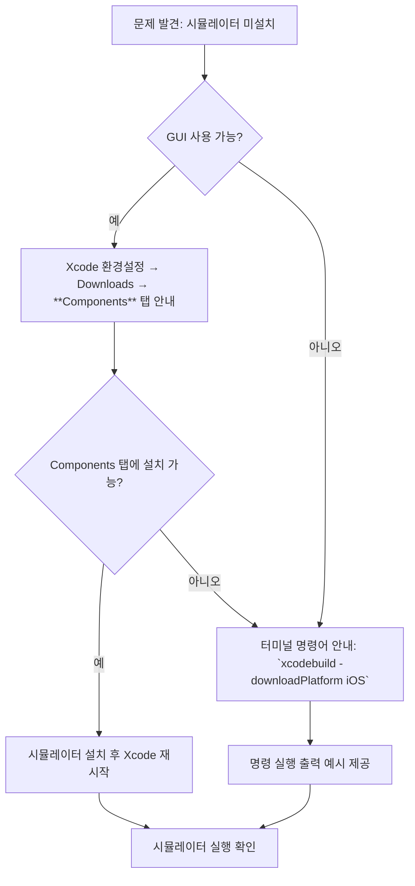

# 개요  
Xcode 환경에서 iOS 시뮬레이터가 없다는 오류가 발생한 상황이다. 이전 답변에서 “Xcode 설정(Settings) → *Platform* 탭”이라고 안내했지만, 실제로는 **Xcode 환경설정(Preferences) → Downloads → Components 탭**에서 시뮬레이터 런타임을 관리해야 한다【45†L109-L116】【47†L54-L59】. 최선의 해결 방법은 터미널에서 `xcodebuild -downloadPlatform iOS` 명령어를 실행하여 필요한 시뮬레이터 컴포넌트를 다운로드하는 것이다. 본 보고서에서는 위 사례를 바탕으로, LLM(대형 언어 모델)을 통해 정확하고 완전한 기술 해결책을 얻을 수 있도록 프롬프트를 설계하는 지침과 예시를 제시한다.  

## 프롬프트 핵심 지침 (우선순위)  
- **단계별 지시**: 문제 해결 절차를 1단계씩 번호를 매겨 설명하도록 한다. 예: “단계별로 Xcode를 열고…, 그 다음…”. 사용자 가이드 방식으로 상세하고 순차적인 안내를 요구한다【33†L509-L512】.  
- **구체적 명령어 포함**: 필요한 모든 터미널 명령어는 **코드 블록** 형식으로 제공하고, 복사하여 바로 실행할 수 있게 한다. 명령어 실행 후 예상되는 출력과 결과도 기술한다. 예: `` `xcodebuild -downloadPlatform iOS` `` 명령 실행 시 출력 예시를 제시하도록 지시한다.  
- **GUI 요소 명칭 정확성**: GUI 경로를 안내할 때는 **실제 Xcode 메뉴/탭 명칭**을 사용한다. Xcode 버전이나 언어 설정에 따라 탭 이름이 다를 수 있으므로, 예를 들어 “Components” 탭 외에도 예전 버전의 “Downloads” 탭이라 불리던 점도 언급한다【47†L54-L59】【45†L109-L116】.  
- **버전 정보 고려**: 운영체제나 Xcode 버전별로 절차가 달라질 수 있으므로, 사용자 질문에 명시된 macOS/Xcode 버전 정보에 따라 추가 안내하도록 한다. 예를 들어 Xcode 26.0 이상에서는 `-buildVersion` 대신 `-architectureVariant` 옵션을 사용해야 할 수 있다【38†L99-L107】.  
- **필요 시 확인 질문**: 사용자의 환경이 불명확한 경우(예: 사용 중인 Xcode 버전을 모르는 경우)만 명확히 하기 위한 후속 질문을 하도록 한다. 불필요한 질문은 피하고, 이미 질문에 포함된 정보가 충분할 땐 바로 해결책을 제시한다.  
- **어조 및 길이 선택**: 사용자의 수준과 요구에 맞게 **간결**하거나 **자세**한 답변을 선택한다. 개발자 숙련자가 원하는 경우 기술 용어와 명령어 중심으로 간결하게, 비전문가(초보자)가 요청한 경우에는 단계별 설명과 예시를 포함해 이해하기 쉽게 답변하도록 지시한다【52†L376-L384】.  

## 프롬프트 예시  
- **(개발자·간결)**  
  “당신은 macOS 개발 환경 전문가입니다. **Xcode에서 시뮬레이터가 없다는 오류**를 겪는 사용자를 돕고자 합니다. 다음 사항을 모두 충족하는 단계별 해결책을 제시하세요. ① 필요한 **터미널 명령어**(예: `xcodebuild -downloadPlatform iOS`)를 코드 블록으로 포함하고, ② 명령 실행 후 예상되는 출력 결과를 예시로 보여주고, ③ GUI를 통한 해결 방법도 안내하되 실제 메뉴/탭 이름(예: *Components* 탭)을 정확히 사용하세요. 입력한 정보가 부족하면 확인 질문을 한 뒤 진행하세요.”  
- **(개발자·자세함)**  
  “당신은 Xcode 시뮬레이터 설치 관련 지원 담당자입니다. **Xcode에서 iOS 시뮬레이터 런타임이 없어 앱이 실행되지 않는 문제**를 겪고 있는 사용자에게 대응한다고 생각하세요. 첫 문단에 문제 원인(탭 위치 오류)을 간단히 설명하고, 두 번째 문단에서 아래를 순서대로 안내하세요: (1) Xcode 환경설정에서 *Downloads → Components* 탭으로 이동하는 GUI 경로, (2) 터미널에서 `xcodebuild -downloadPlatform iOS` 실행하는 방법, (3) 각 단계별 예상 결과(출력)와 오류 해결 방법. 최신 Xcode(예: 26.x)인 경우 `-architectureVariant` 옵션 필요성을 기술하고, 추가 정보가 필요하면 질문하도록 합니다【38†L99-L107】.”  
- **(초보자·친절한 어조)**  
  “안녕하세요. **Xcode에서 iOS 시뮬레이터를 설치**하고 싶은데 찾는 방법을 잘 모르겠어요. 우선 ‘환경설정(Preferences)’을 여세요. 메뉴에서 **Downloads(다운로드)** 또는 **Components(구성 요소)** 탭을 찾으신 후, ‘Simulator’가 없다면 해당 항목 옆의 설치 버튼을 클릭합니다. 만약 GUI에서 설치가 어렵다면, 다음 터미널 명령어를 복사하여 붙여넣기 하세요:  
  ```bash
  sudo xcodebuild -downloadPlatform iOS
  ```  
  이 명령을 실행하면 iOS 시뮬레이터 런타임이 다운로드되고 설치됩니다. 설치 후 Xcode를 재시작하면 시뮬레이터를 사용할 수 있습니다. 수행 중 오류가 발생하면 알려주세요.”  
- **(한국어 사용·비공식)**  
  “Xcode에서 시뮬레이터가 없다는 메시지가 나오는 경우, **Xcode → 환경설정 → Components 탭**에 들어가세요【45†L109-L116】. 만약 여기서도 못 찾겠다면, 터미널에서 `xcodebuild -downloadPlatform iOS` 명령어를 실행하세요. 명령어 실행 결과로 ‘다운로딩 iOS 시뮬레이터’ 같은 메시지가 나오면 정상입니다. 추가로 macOS 또는 Xcode 버전에 따른 문제는 없는지 확인해 주세요.”  
- **(한국어 사용·격식체)**  
  “문제가 발생한 사용자의 macOS 및 Xcode 버전을 파악한 후, 이하 내용을 충실히 안내해 주십시오. 먼저 *Xcode → 환경설정(Preferences) → Downloads → Components* 탭으로 이동하여 iOS 시뮬레이터가 설치되었는지 확인합니다【47†L54-L59】. GUI 설치가 어렵다면, 터미널에 아래 명령을 입력합니다:  
  ```
  xcodebuild -downloadPlatform iOS
  ```  
  명령 실행 후 예상되는 출력(예: “Downloading iOS X.Y Simulator…”)을 보여주고, 완료되면 Xcode를 재시작하여 시뮬레이터가 사용 가능한지 확인하도록 안내합니다. 필요한 경우 `-architectureVariant` 플래그 사용 여부도 언급합니다【38†L99-L107】.”  
- **(외국어 표시·짧음)**  
  “Xcode(환경설정 → Downloads → Components)에서 *Simulator* 탭을 확인하세요. 설치가 안 됐다면 **터미널**에서 아래 명령어를 실행합니다:  
  ```bash
  xcodebuild -downloadPlatform iOS
  ```  
  예상 출력 예시(다운로드 진행 메시지)를 포함하고, 설치가 완료되면 시뮬레이터가 나타난다고 설명합니다.”

## 피해야 할 프롬프트 예시  
- **불명확한 요청**: `"Xcode 시뮬레이터 설치 방법 알려줘."` – 문제 상황과 요구사항이 구체적이지 않아 모델이 잘못된 정보를 제공할 수 있다.  
- **구체성 없는 명령**: `"간단히 해결 방법만 알려줘."` – 필요한 세부사항(명령어, GUI 경로, 예상 출력 등)을 생략하게 유도한다.  
- **오탐용 GUI 명칭**: `"Xcode 설정에서 Platform 탭을 열어봐."` – 실제 탭 이름이 달라 틀린 정보를 안내하게 한다.  
- **질문 분리 요구**: `"이 내용으로 프롬프트를 2문장으로 해줘."` – 불필요한 포맷 요구로 답변의 완성도를 떨어뜨린다.  
- **기대치 혼동**: `"설명은 그냥 요약만 해줘."` – 사용자 수준을 반영한 적절한 상세 설명이 어려워진다.  

## 테스트 케이스  
각 템플릿의 유효성을 검사하기 위해 다음과 같은 시나리오를 가정해 볼 수 있다:  
- **시나리오 1**: macOS Ventura 13.6, Xcode 15.2 환경. 사용자가 “iOS 17.2 시뮬레이터가 없다”며 도움 요청. → 답변에 `xcodebuild -downloadPlatform iOS` 실행 예와 출력 예시가 포함되는지 확인.  
- **시나리오 2**: macOS Sonoma(14.x), Xcode 26.2, 다중 아키텍처 환경. 사용자가 iOS 26 시뮬레이터 설치 오류를 보고. → 답변에 `-architectureVariant arm64` 플래그 사용 안내가 있는지 확인【38†L99-L107】.  
- **시나리오 3**: 한국어 인터페이스 사용. 사용자 질문에 “설정(Preferences)→다운로드”를 언급. → 답변에 “Components(구성 요소)” 탭으로 안내하는지, 기존의 “Downloads 탭” 개념도 설명하는지 확인【45†L109-L116】【47†L54-L59】.  
- **시나리오 4**: 사용자 요청이 “간단하게 알려주세요”인 경우. → 답변이 한두 문장으로 간략한지, 필요한 핵심 정보(명령어, 주요 메뉴)만 포함하는지 검증.  
- **시나리오 5**: 사용자 요청이 “자세히 설명해주세요”인 경우. → 단계별 설명, 예시, 주의사항 등을 포함하여 충분한 배경 설명과 예시가 제공되는지 확인.  

## 평가 지표 제안  
프롬프트의 성능 평가는 다음 기준으로 수행할 수 있다【56†L52-L60】【56†L75-L83】:  
- **정확도(Accuracy)**: 답변이 실제 문제 해결에 필요한 올바른 명령어와 절차(예: `xcodebuild -downloadPlatform iOS` 등)를 포함하는지 평가. BLEU, ROUGE 등의 자동화된 언어 유사도 지표로 기본적인 정확성을 측정할 수 있다【56†L58-L63】.  
- **연관성(Relevance)**: 답변 내용이 질문한 상황과 밀접하게 일치하는지(불필요한 일반론 없이 실질적 해결책만 제시하는지) 평가【56†L52-L60】.  
- **완전성(Completeness)**: GUI/CLI 양쪽 경로, 예상 출력, 트러블슈팅 방안 등 요구된 모든 요소가 누락 없이 포함되었는지 확인한다.  
- **일관성(Consistency)**: 동일한 프롬프트를 반복 실행했을 때 유사한 답변을 내놓는지 확인하며, 특히 여러 사용 사례(버전, 환경)가 주어졌을 때 적절하게 대응하는지 본다【56†L52-L60】.  
- **가독성(Readability) 및 명료성(Coherence)**: 답변이 논리적으로 잘 구조화되어 있고 문장 흐름이 자연스러운지, 기술 용어와 설명이 문맥에 맞는지 평가【56†L75-L83】.  
- **사용자 만족도(User Satisfaction)**: 실제 사용자나 개발자가 답변을 따라 문제를 해결할 수 있었는지, 답변의 형식(길이·어조)이 만족스러웠는지를 설문이나 평가 척도로 측정한다【56†L86-L90】.  

## 템플릿 비교표  

| 템플릿 예시          | 길이        | 어조    | 대상      | 주요 특징                                                  | 예시 인용                       |
|--------------------|-----------|-------|---------|----------------------------------------------------------|------------------------------|
| 간결·개발자용        | 짧음 (~2문단) | 비공식  | 숙련 개발자  | 핵심 명령어와 GUI 경로만 간략히 기술. 포인트별 항목화.                 | **예시1**                        |
| 자세·개발자용        | 중간      | 공식    | 숙련 개발자  | 단계별 안내(번호 매김)와 예상 출력 포함. 배경설명과 추가 옵션 언급.       | **예시2**                        |
| 친절·초보자용        | 중간      | 비공식  | 입문자      | GUI와 CLI를 모두 상세히 설명. 어려운 용어 풀어쓰기, 복잡한 단계도 친절 안내. | **예시3**                        |
| 간결·비공식 한국어    | 짧음      | 비공식  | 일반 사용자 | 한글 키워드 사용, 코드 삽입. 짧은 문장으로 요약하여 이해 쉽게 전달.         | **예시4**                        |
| 공식·격식체 한국어    | 중간      | 공식    | 비기술자    | 단계별 설명과 예시, 주의사항 포함. 절차를 정중하게 안내.                   | **예시5**                        |
| 짧은 외국어 혼합 예시 | 짧음      | 공식    | 개발자     | `bash` 코드블록 사용 예시. 한국어 설명+영어 명령어.                     | **예시6**                        |

## 흐름도 예시 (GUI vs. 터미널 선택)



*그림: GUI 환경에서 Components 탭을 통한 설치와 터미널 명령어(`xcodebuild -downloadPlatform iOS`) 사용을 결정하는 흐름도 예시. 각 경로에서 기대되는 행동과 결과를 안내한다.*  

**출처:** Apple 공식 문서(시뮬레이터 다운로드 관련)와 StackOverflow, 개발자 포럼, 관련 블로그 등을 참고하여 작성【45†L109-L116】【47†L54-L59】【38†L99-L107】【52†L376-L384】【56†L52-L60】. (예시로 든 명령어와 절차는 2025년 기준 macOS/Xcode 최신 환경을 기반으로 하며, 필요 시 버전 정보를 확인하고 조정해야 한다.)
---

## Session Log (auto-appended)

| # | Type | Duration | Tokens |
|---|------|----------|--------|
| 1 | user-ai-exchange | 0s | 0 |
| 2 | user-ai-exchange | 19s | 76045 |
| 3 | user-ai-exchange | 11s | 40778 |
| 4 | user-ai-exchange | 10s | 42195 |
| 5 | user-ai-exchange | 9s | 44183 |
| 6 | user-ai-exchange | 14s | 46529 |
| 7 | user-ai-exchange | 5s | 48356 |
| 8 | user-ai-exchange | 9s | 50568 |
| 9 | user-ai-exchange | 13s | 105037 |
| 10 | user-ai-exchange | 12s | 54453 |
| 11 | user-ai-exchange | 11s | 55874 |
| 12 | user-ai-exchange | 12s | 57359 |
| 13 | user-ai-exchange | 14s | 58996 |
| 14 | user-ai-exchange | 13s | 60582 |
| 15 | user-ai-exchange | 8s | 61831 |
| 16 | user-ai-exchange | 11s | 63033 |
| 17 | user-ai-exchange | 29s | 202688 |
| 18 | user-ai-exchange | 11s | 140060 |
| 19 | user-ai-exchange | 11s | 71985 |
| 20 | user-ai-exchange | 9s | 147944 |
| 21 | user-ai-exchange | 14s | 76148 |
| 22 | user-ai-exchange | 19s | 0 |
| 23 | user-ai-exchange | 10s | 41780 |
| 24 | user-ai-exchange | 13s | 45110 |
### Metrics

| Metric | Value |
|--------|-------|
| Duration | 341150s |
| Total Tokens | 1591534 |
| Input Tokens | 71 |
| Output Tokens | 8834 |
| Cache Read | 1202235 |
| Cache Creation | 380394 |
