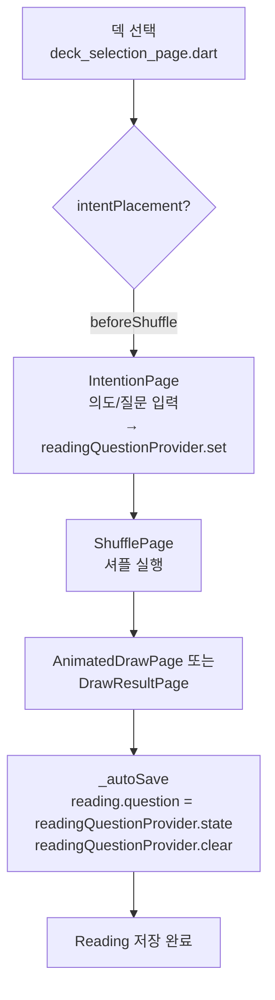
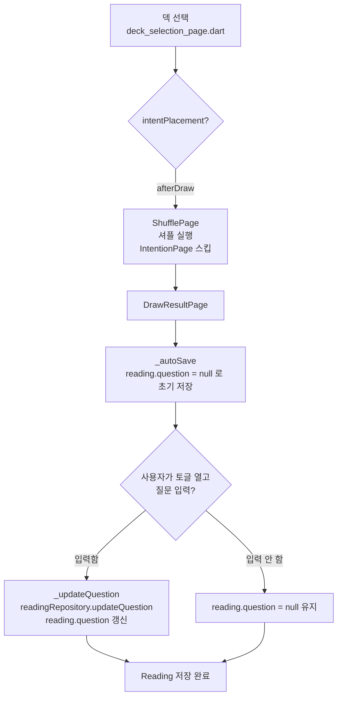
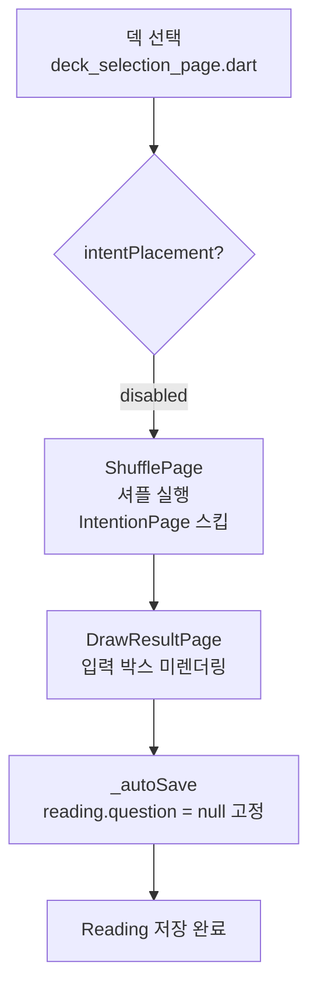

# Draw Flow Guide — 의도 설정(IntentPlacement) 3가지 모드

## 1. Overview

`IntentPlacement`는 뽑기 플로우에서 **의도(질문) 입력이 언제 나타나는가**를 결정하는 사용자 설정이다.
타로 뽑기는 사람마다 사용 방식이 다르다: 어떤 사람은 카드를 뽑기 전 조용히 질문을 정리하는 의식을 선호하고,
어떤 사람은 카드를 먼저 본 후 떠오른 감상을 적고 싶고, 어떤 사람은 아무 질문 없이 빠르게 진행하기를 원한다.
이 세 가지 패턴을 단일 설정 필드(`UserSettings.intentPlacement`)로 노출한다.

**배경**: 구현 전에는 IntentionPage(셔플 전 풀 화면)와 DrawResultPage(결과 화면 토글) 두 곳에
의도 입력이 중복 존재했으며, DrawResultPage 입력이 저장본에 반영되지 않는 버그가 있었다.
이 가이드가 기술하는 구현(Cycles 1–3)에서 두 문제를 동시에 해결했다.

참조: [`040_Brief_intent_placement_setting.md`](../2_tarot_draw/03_draw_experience_settings/040_Brief_intent_placement_setting.md)

---

## 2. Three Modes

### beforeShuffle (기본값)

셔플 직전 `IntentionPage` 전체 화면이 표시된다. 사용자는 텍스트 필드에 의도/질문을 입력하고
"셔플 시작" 버튼을 누른다. 입력값은 `readingQuestionProvider`에 저장되어 결과 화면의 `_autoSave`
시점에 `reading.question`으로 기록된다. 기존 동작과 동일하여 기존 사용자 회귀가 없다.

### afterDraw

덱 선택 후 IntentionPage를 건너뛰고 셔플 → 결과 화면으로 직행한다. 결과 화면 상단에 접을 수 있는
"질문이 있으신가요? (선택)" 토글이 나타나며, 사용자가 토글을 열고 텍스트를 입력 후 완료하면
`readingRepository.updateQuestion(readingId, text)`가 호출되어 이미 저장된 reading 레코드를 갱신한다.
카드를 먼저 보고 질문이 떠오른 경우에 적합하다.

### disabled

의도 입력 없이 덱 선택 → 셔플 → 결과 화면으로 직행한다. 결과 화면에 입력 박스가 렌더링되지 않으며
`reading.question`은 항상 `null`로 저장된다. 반복적·빠른 뽑기를 선호하는 사용자에게 적합하다.

---

## 3. Mermaid Flow Diagrams

### beforeShuffle



### afterDraw



### disabled



---

## 4. Code Entry Point Table

| 모드 | 라우팅 분기 | IntentionPage 동작 | DrawResultPage 입력 박스 | reading.question 설정 주체 |
|------|-----------|------------------|------------------------|--------------------------|
| `beforeShuffle` | `home_page.dart:_startDraw` (Lv3/4) → `context.pushNamed('intention', ...)` | 정상 렌더, 텍스트 입력 후 셔플로 push | 렌더링 안 됨 (`intentPlacement != afterDraw`) | `IntentionPage` → `readingQuestionProvider.set()` → `_autoSave`에서 복사 |
| `afterDraw` | `home_page.dart:_startDraw` (Lv3/4) → `context.pushNamed('shuffle', ...)` | `_redirectChecked` / `_maybeRedirect` → `pushReplacementNamed('shuffle')` | 렌더링됨, 토글 → `_updateQuestion()` 호출 | `_updateQuestion` → `readingRepository.updateQuestion(readingId, text)` |
| `disabled` | `home_page.dart:_startDraw` (Lv3/4) → `context.pushNamed('shuffle', ...)` | `_redirectChecked` / `_maybeRedirect` → `pushReplacementNamed('shuffle')` | 렌더링 안 됨 | 없음 (항상 null) |

### 핵심 파일 및 함수

| 파일 | 함수/심볼 | 역할 |
|------|---------|------|
| `mobile/lib/features/home/presentation/pages/home_page.dart` | `_startDraw(experienceLevel, deckId)` L75 | intentPlacement 읽어 라우팅 분기 결정 |
| `mobile/lib/features/deck/presentation/pages/deck_selection_page.dart` | onTap 콜백 L46–49 | deck 선택 시 동일 분기 로직 적용 |
| `mobile/lib/features/shuffle/presentation/pages/intention_page.dart` | `_redirectChecked`, `_maybeRedirect()`, `settingsAsync.whenData()` | 직접 URL 진입 시 redirect 안전 처리 |
| `mobile/lib/features/draw/presentation/pages/draw_result_page.dart` | `_autoSave()` L113, `_updateQuestion()` L133 | 초기 저장 및 사후 question 갱신 |
| `mobile/lib/features/settings/domain/entities/intent_placement.dart` | `IntentPlacement` enum | 3값 정의, JSON 직렬화, 라벨 extension |

---

## 5. Save Timing Table

| 모드 | 1단계: 초기 저장 (`_autoSave`) | 2단계: question 갱신 | 최종 reading.question |
|------|------------------------------|--------------------|--------------------|
| `beforeShuffle` | 카드 공개 직후, `_questionController.text` = readingQuestionProvider 값 | 없음 | IntentionPage 입력값 |
| `afterDraw` | 카드 공개 직후, `question = null` (readingQuestionProvider는 빈 문자열) | 사용자가 토글 열고 텍스트 submit → `readingRepository.updateQuestion(readingId, text)` | 사용자 입력값 (미입력 시 null) |
| `disabled` | 카드 공개 직후, `question = null` | 없음 | 항상 null |

**저장 정합성 주의점**:
- `afterDraw` 모드에서 사용자가 결과 화면을 즉시 이탈하면 question = null인 reading이 남는다. 이는 허용된 상태다 (질문은 선택 사항).
- `beforeShuffle` 모드에서 `readingQuestionProvider`는 `_autoSave` 직후 `clear()`된다 (intention_page.dart `initState`의 `addPostFrameCallback`으로 다음 진입 시 초기화).

---

## 6. Decision Tree — 어떤 모드를 추천하나?

```
뽑기 전에 질문/의도를 정리하는 의식이 중요하다
  → beforeShuffle (기본값)

카드를 먼저 보고 떠오른 감상을 적고 싶다
  → afterDraw

의도 입력 없이 빠르게 반복 뽑기를 한다
  → disabled
```

---

## 7. Implementation References

### 관련 커밋

| 커밋 | 영역 | 내용 |
|------|------|------|
| `bb52950` | Cycle 1: data layer | `IntentPlacement` enum, `UserSettings.intentPlacement` 필드, Drift v8→v9 마이그레이션, Dao update 메서드 |
| `ae72da3` | Cycle 2: settings UI | `IntentPlacementSettingsPage`, 라우트 `/settings/intent-placement`, DrawSettingsPanel 진입 행 |
| `42e5339` | Cycle 3: flow integration | `_startDraw` 분기, `IntentionPage` redirect, `DrawResultPage` 조건부 + `updateQuestion`, `readingRepository.updateQuestion` 신규 메서드 |

### 핵심 파일 목록

```
mobile/lib/features/settings/domain/entities/intent_placement.dart       # enum 정의
mobile/lib/features/settings/domain/entities/user_settings.dart          # intentPlacement 필드
mobile/lib/features/settings/presentation/pages/intent_placement_settings_page.dart  # 설정 UI
mobile/lib/features/home/presentation/pages/home_page.dart               # _startDraw 분기
mobile/lib/features/deck/presentation/pages/deck_selection_page.dart     # deck 선택 후 분기
mobile/lib/features/shuffle/presentation/pages/intention_page.dart       # redirect 로직
mobile/lib/features/draw/presentation/pages/draw_result_page.dart        # 조건부 UI + updateQuestion
mobile/lib/features/reading/domain/repositories/reading_repository.dart  # updateQuestion 시그니처
mobile/lib/features/reading/data/repositories/reading_repository_impl.dart  # 구현체
mobile/lib/core/database/app_database.dart                               # schemaVersion 9
mobile/lib/core/database/tables/user_settings_table.dart                 # intent_placement 컬럼
```

---

## 8. Testing Entry Points

| 테스트 파일 | 커버 영역 |
|------------|---------|
| `mobile/test/features/settings/intent_placement_test.dart` | `IntentPlacement` enum 직렬화, `UserSettings` Freezed 필드, Drift v9 마이그레이션 |
| `mobile/test/features/settings/intent_placement_settings_page_test.dart` | 설정 페이지 3-way 선택 UI, 선택 시 provider 반영 |

**참고**: Cycle 3 플로우 통합(라우팅 분기 / IntentionPage redirect / DrawResultPage 조건부)은
GoRouter 의존성으로 인해 별도 integration test 파일이 추후 추가될 수 있다. 현재는 수동 검증 기준:
- `beforeShuffle`: 덱 선택 → IntentionPage 표시 확인
- `afterDraw`: 덱 선택 → 직행 셔플, 결과 화면 토글 확인
- `disabled`: 덱 선택 → 직행 셔플, 결과 화면 입력 박스 미표시 확인
